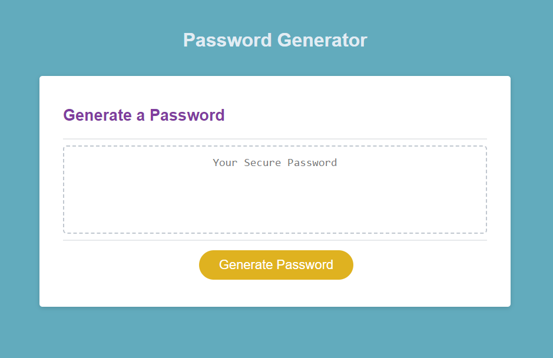
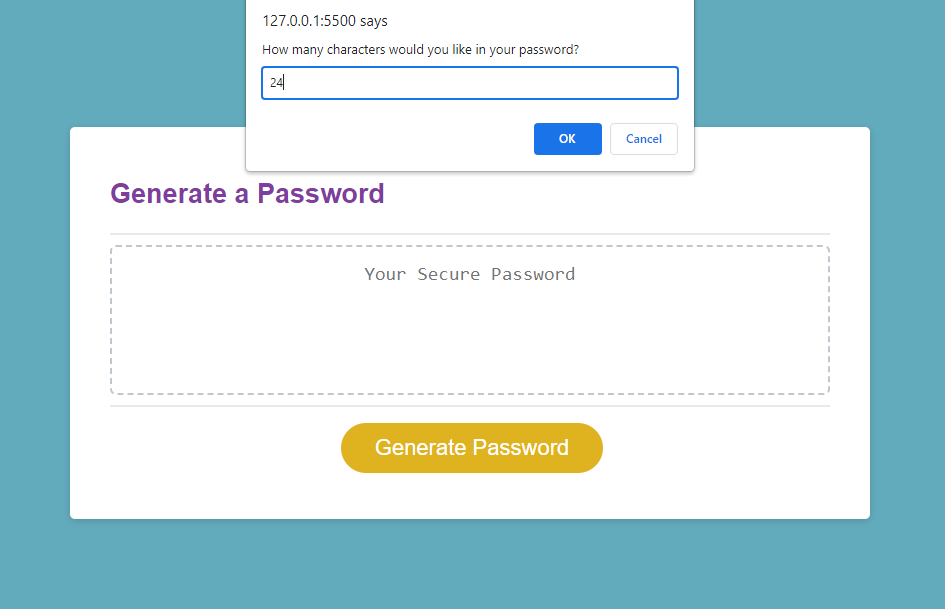
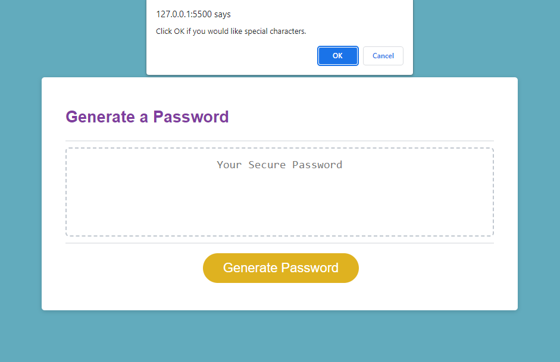
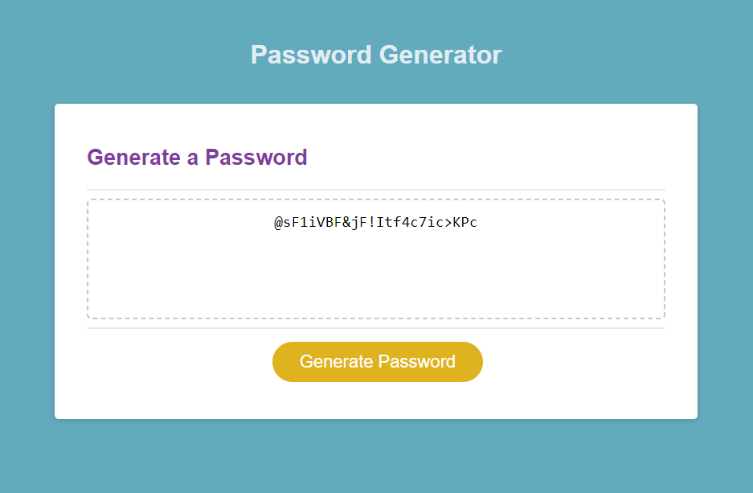

# Password Generator

## Description

Simple Password Generator App built with HTML, CSS, and JavaScript. Randomly generates a strong password that provides greater security.

## Table of Contents 
* [Description](#description)
* [Usage](#usage)
* [Screenshots](#screenshots)
* [License](#license)
* [Badge](#badge)
* [Questions](#questions)

## Usage 

Click on the button to generate a password and answer the series of prompts displayed for password criteria, such as length and character types to use. When all the prompts are answered, a password is generated that matches the selected criteria and is written to the page.

## Screenshots

 

 

## License

## Badge

## Questions

* If you have any questions or concerns, please contact me at [Github](https://github.com/ricapi96), email me at enroquemore@gmail.com.

